# Snowflake Cortex Agent Setup Guide

This documentation goes step by step on how to set up Snowflake Cortex Agent.

## Overview

Cortex Agents orchestrate across both structured and unstructured data sources to deliver insights. They plan tasks, use tools to execute these tasks, and generate responses. Agents use Cortex Analyst (structured) and Cortex Search (unstructured) as tools, along with LLMs, to analyze data. Cortex Search extracts insights from unstructured sources, while Cortex Analyst generates SQL to process structured data. In addition, you can use stored procedures and user defined functions (UDFs) to implement custom tools.

The agent workflow involves four key components:

1. Planning: Applications often switch between processing data from structured and unstructured sources
2. Tool use: With a plan in place, the agent retrieves data efficiently. Cortex Search extracts insights from unstructured sources, while Cortex Analyst generates SQL to process structured data.
3. Reflection: After each tool use, the agent evaluates results to determine the next steps - asking for clarification, iterating, or generating a final response.
4. Monitor and iterate: After deployment, customers can track metrics, analyze performance and refine behavior for continuous improvements.

## Setting Up Process

1. Create a Snowflake role for Cortex Agent using the guide below.

```
USE ROLE ACCOUNTADMIN;
CREATE ROLE cortex_agent_user_role;
GRANT DATABASE ROLE SNOWFLAKE.CORTEX_AGENT_USER TO ROLE cortex_agent_user_role;
GRANT ROLE cortex_agent_user_role TO USER <whatever-user>;

-- Grant database usage
GRANT USAGE ON DATABASE ANALYTICS TO ROLE cortex_agent_user_role;

-- Grant schema usage
GRANT USAGE ON SCHEMA ANALYTICS.REPORTING TO ROLE cortex_agent_user_role;

-- Grant SELECT on semantic view -- Run this after you have created a semantic view.
GRANT SELECT ON VIEW ANALYTICS.REPORTING.<Agent-Created> TO ROLE cortex_agent_user_role;
```

2. Go to the AI & ML section on the Snowflake UI and click on Agents, then click on Create Agents to create a new Agent.

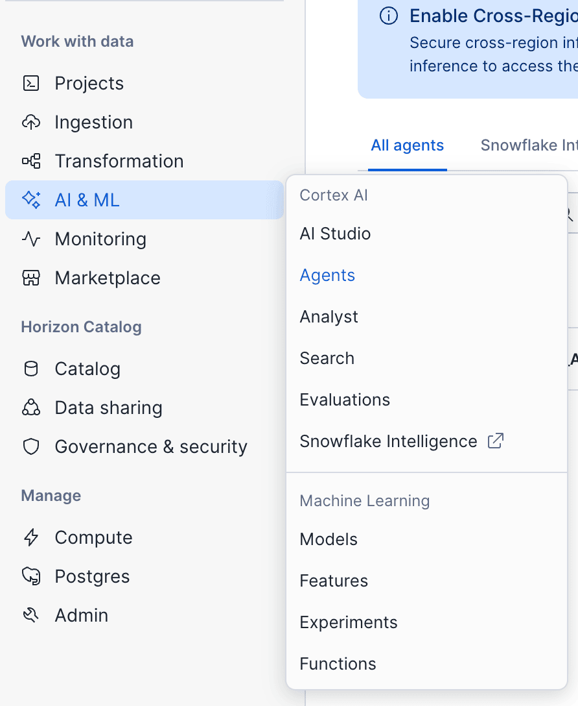
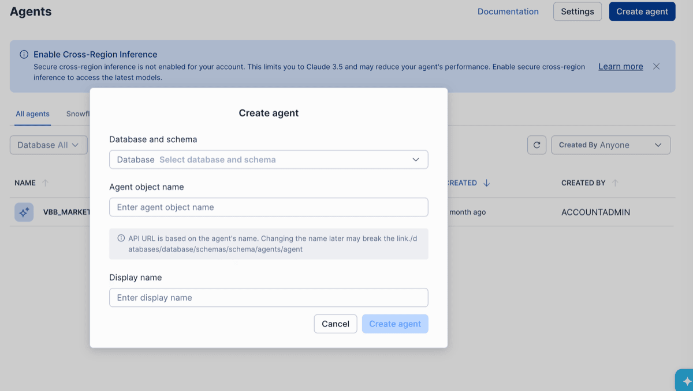

3. Select Database and Schema where the Agent will run, give the agent a name and create the agent.

4. Below highlights what you will find in the Agent UI after creation.

### The About Tab

- **Agent name:** Name of Agent
- **Description:** Agent Description
- **Example questions:** Example questions that users will see on Snowflake Intelligence

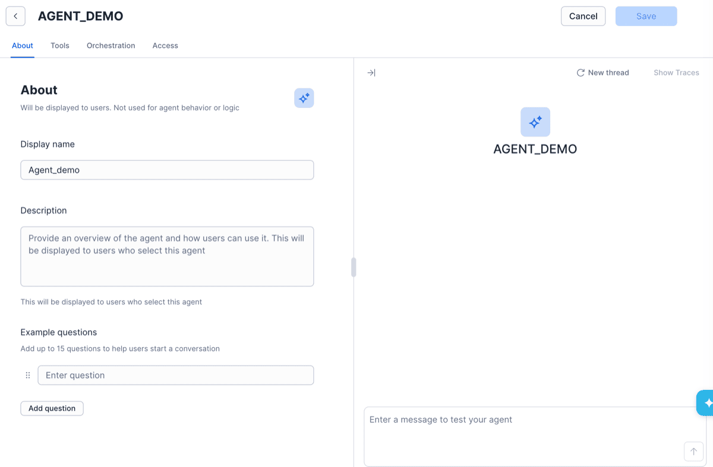

### The Tools Tab

- **Web Search:** Allows agent to access the internet
- **Cortex Analyst:** This allows you to select a cortex analyst that has been created to get context from structured data.
- **Cortex Search:** This allows you to select a search service for unstructured data.
- **Custom Tools:** This allows you to create custom tools using UDFs that the agent can call.

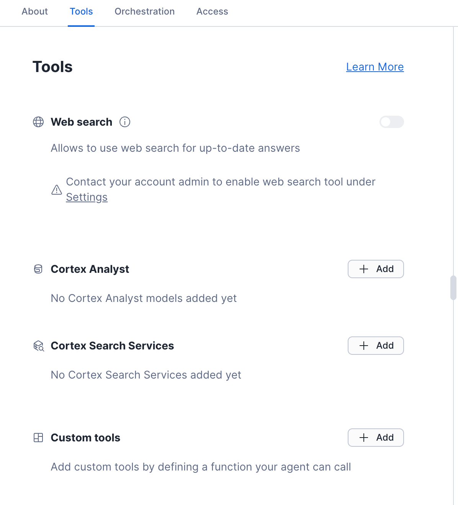

### The Orchestration Tab

- **Model:** Allows you to select which model you want the Agent to use or set it to Auto for the Agent to select which model to use.
- **Orchestration Instructions:** Define how the agent reasons through tasks, chooses the right tools, and sequences actions. This is more useful for Agents that have access to multiple analyst and search services to choose from when a user asks a question.
- **Response Instruction:** Set rules for how the agent should sound and respond to users. This is helpful to guide the agent on how it should sound.
- **Budget Configuration:** Allows you to set limits for time run and token usage.

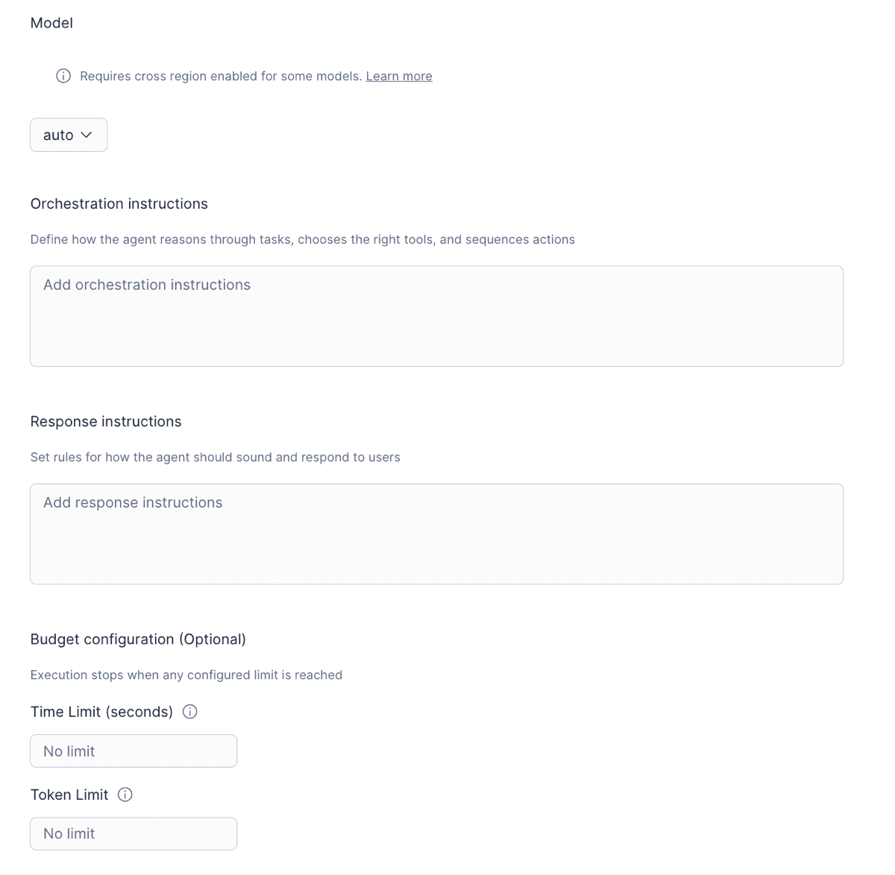

### The Access Tab

This allows you to grant access to any roles that should use the Agent. For example, if I wanted a Snowflake user to access the agent in Snowflake Intelligence, that user's role should be granted access.

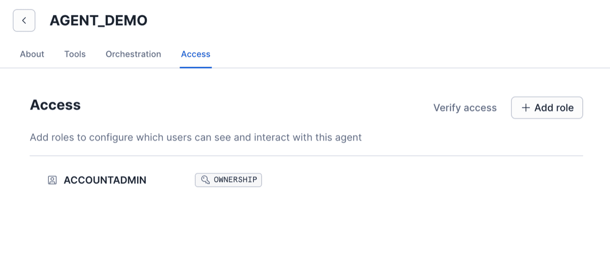

## How to Create Cortex Analyst

There are two ways to create this: either from the Snowflake UI or by calling a Snowflake Stored Procedure.

### Using the Snowflake UI

Below is a step-by-step pictorial guide using the Snowflake UI.

1. 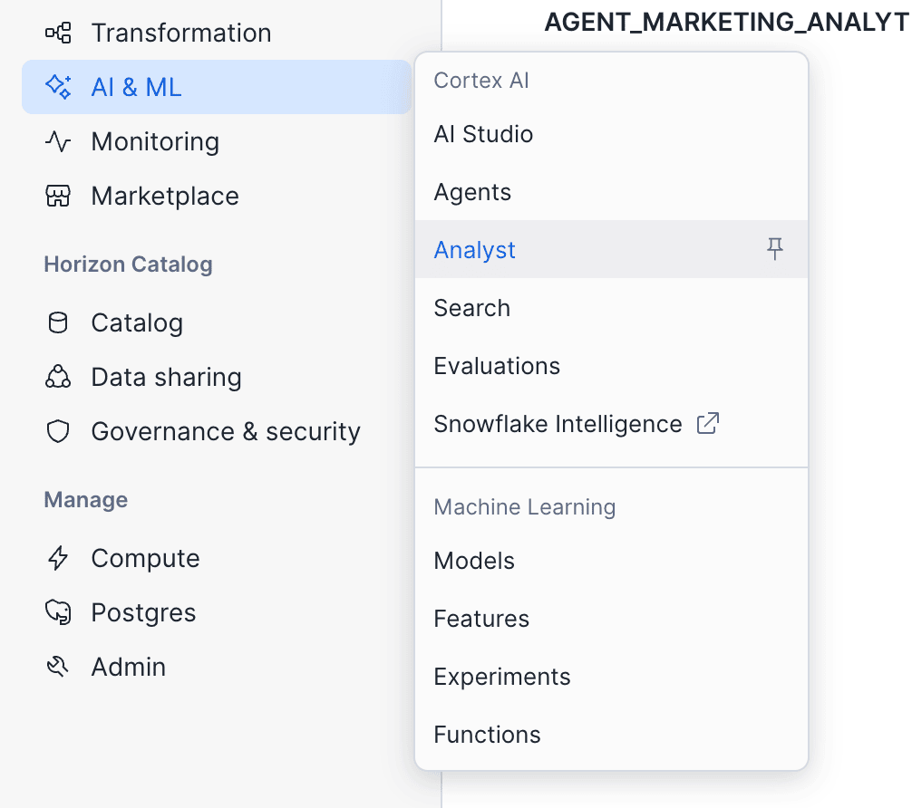

   Use Semantic View instead of model.

   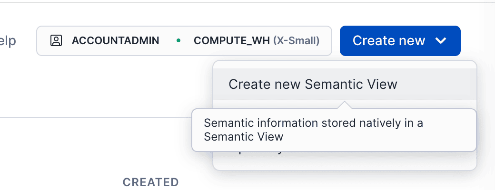

   Select location to store view, and input the name and description of the Agent.

   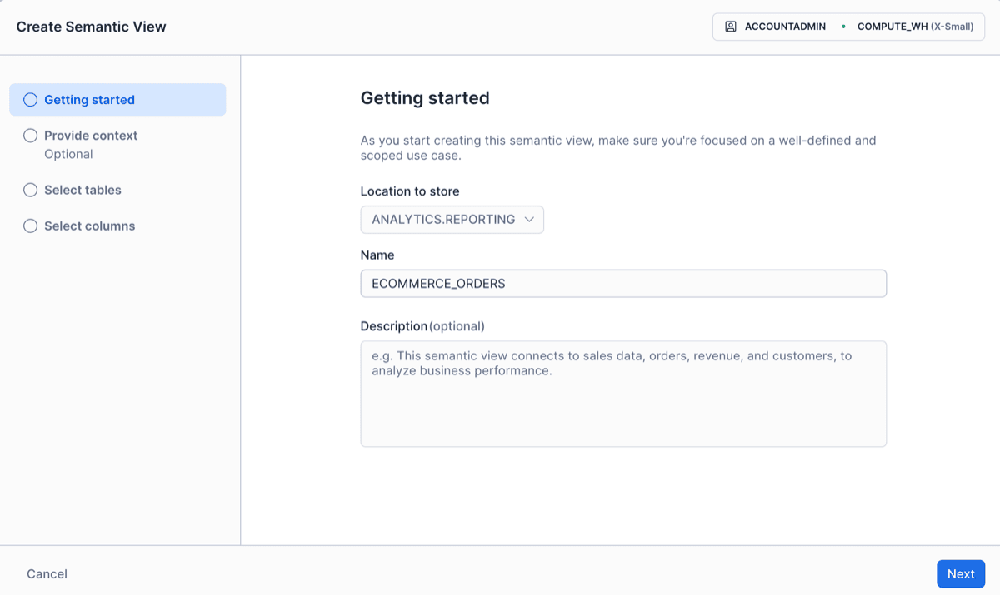

   Select tables to be used for the semantic view.

   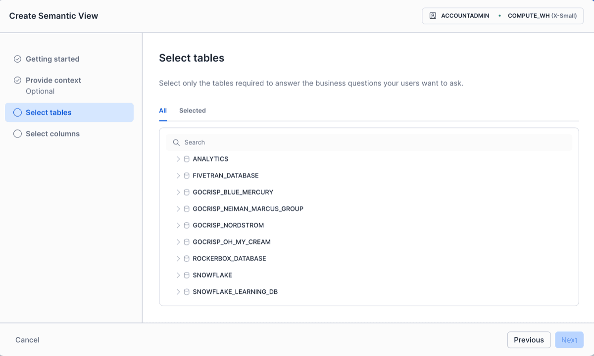

   Select columns to be included in the semantic view and create the Semantic view for the agent.

   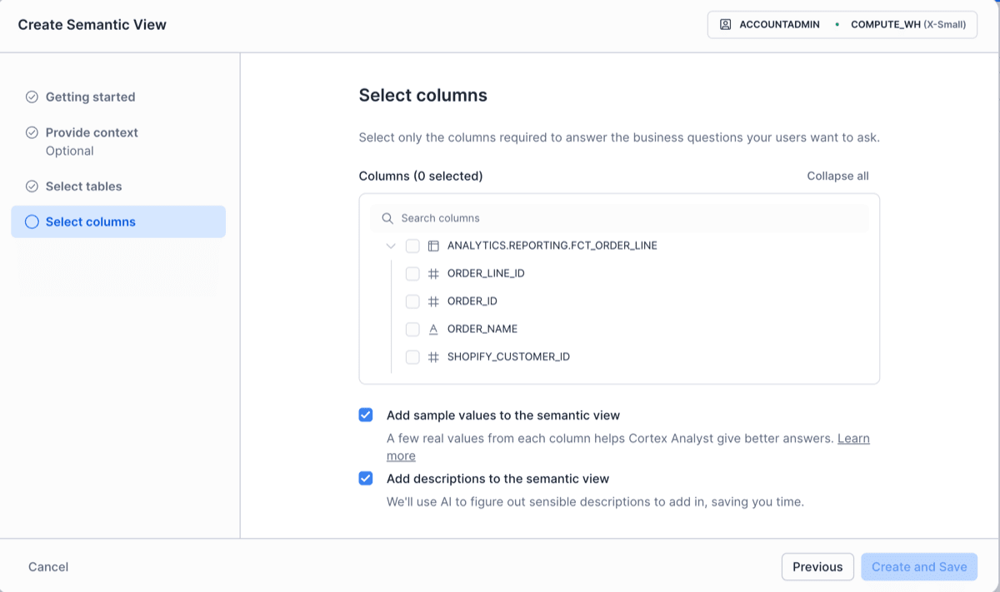

### Using Stored Procedure

Below is how to create a Semantic View for Cortex Analyst using a Stored Procedure.

`CALL SYSTEM$CREATE_SEMANTIC_VIEW_FROM_YAML(arg, arg)`

This SP allows 1 or 2 inputs where the compulsory input is the Semantic view instructions that shows the tables, columns, metrics, dimensions and relationships between the tables.
The second optional arg is TRUE, when TRUE is added, this will check if your YAML file is valid for creating a semantic view but no object will be created. But without the TRUE arg the semantic view object will be created and can be seen in the database explorer.

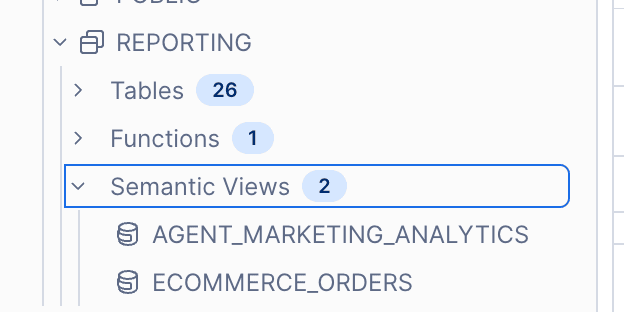

Below is an example query calling the stored procedure.

```
ANALYTICSCALL SYSTEM$CREATE_SEMANTIC_VIEW_FRSOM_YAML(
  'ANALYTICS.REPORTING',
  $$
  name: AGENT_MARKETING_ANALYTICS
  description: Marketing attribution and performance analytics for Victoria Beckham Beauty
  tables:
    - name: MARKETING_ACTIVITY
      description: Granular marketing touchpoint data with attribution weights
      base_table:
        database: ANALYTICS
        schema: REPORTING
        table: FCT_MARKETING_ACTIVITY
      primary_key:
        columns:
          - UNIQUE_FIELD
      dimensions:
        - name: CONVERSION_DATE
          synonyms:
            - order date
            - purchase date
            - transaction date
          description: Date when the conversion occurred
          expr: conversion_date
          data_type: DATE
        - name: CONVERSION_YEAR
          synonyms:
            - year
          description: Year of conversion
          expr: YEAR(conversion_date)
          data_type: NUMBER(4,0)
        - name: CONVERSION_MONTH
          synonyms:
            - month
          description: Month number of conversion
          expr: MONTH(conversion_date)
          data_type: NUMBER(2,0)
        - name: CUSTOMER_TYPE
          synonyms:
            - new vs repeat
            - customer segment
          description: Customer classification at time of order
          expr: customer_type
          data_type: VARCHAR
        - name: IS_TOP_OF_FUNNEL
          synonyms:
            - tof
            - top of funnel
          description: Flag identifying top-of-funnel awareness channels
          expr: is_top_of_funnel
          data_type: BOOLEAN
        - name: SEQUENCE_NUMBER
          synonyms:
            - touchpoint sequence
            - touchpoint order
          description: Chronological order of touchpoint in customer journey
          expr: sequence_number
          data_type: NUMBER
        - name: TIER_3
          synonyms:
            - campaign name
            - campaign
          description: Campaign name or tier 3 classification
          expr: tier_3
          data_type: VARCHAR
        - name: ORDER_ID
          expr: order_id
          data_type: NUMBER
        - name: CUSTOMER_ID
          expr: customer_id
          data_type: VARCHAR
        - name: CHANNEL_ID
          expr: channel_id
          data_type: VARCHAR
        - name: CAMPAIGN_ID
          expr: campaign_id
          data_type: VARCHAR
        - name: SKU
          expr: sku
          data_type: VARCHAR
        - name: CONVERSION_HASH_ID
          expr: conversion_hash_id
          data_type: VARCHAR
        - name: ORDER_LINE_ID
          expr: order_line_id
          data_type: NUMBER
      facts:
        - name: WEIGHTED_SPEND
          description: Marketing spend with normalized attribution
          expr: weighted_spend
          data_type: FLOAT
        - name: FIRST_TOUCH_SPEND
          description: Marketing spend attributed to first touch
          expr: first_touch_spend
          data_type: FLOAT
        - name: LAST_TOUCH_SPEND
          description: Marketing spend attributed to last touch
          expr: last_touch_spend
          data_type: FLOAT
        - name: WEIGHTED_CLICKS
          description: Clicks with normalized attribution
          expr: weighted_clicks
          data_type: NUMBER
        - name: WEIGHTED_IMPRESSIONS
          description: Impressions with normalized attribution
          expr: weighted_impressions
          data_type: NUMBER
        - name: GROSS_REVENUE_NO_VAT_NORMALIZED
          description: Gross revenue with normalized attribution
          expr: gross_revenue_no_vat_normalized
          data_type: FLOAT
        - name: GROSS_LESS_DISCOUNT_NO_VAT_NORMALIZED
          description: Gross revenue less discounts with normalized attribution
          expr: gross_less_discount_no_vat_normalized
          data_type: FLOAT
        - name: NORMALIZED_WEIGHT
          description: Multi-touch attribution weight
          expr: normalized_weight
          data_type: FLOAT
      metrics:
        - name: TOTAL_SPEND
          description: Total marketing spend
          synonyms:
            - spend
            - marketing spend
          expr: SUM(weighted_spend)
        - name: TOTAL_CONVERSIONS
          description: Total number of unique conversions
          synonyms:
            - conversions
            - orders
          expr: COUNT(DISTINCT conversion_hash_id)
        - name: ROAS
          description: Return on ad spend
          synonyms:
            - return on ad spend
            - roi
          expr: SUM(gross_less_discount_no_vat_normalized) / NULLIF(SUM(weighted_spend), 0)
        - name: TOTAL_CLICKS
          description: Total ad clicks
          synonyms:
            - clicks
          expr: SUM(weighted_clicks)
        - name: TOTAL_IMPRESSIONS
          description: Total ad impressions
          synonyms:
            - impressions
          expr: SUM(weighted_impressions)
        - name: NEW_CUSTOMERS
          description: Total new customers acquired
          synonyms:
            - new customer count
          expr: COUNT(DISTINCT CASE WHEN customer_type = 'new' THEN customer_id END)
        - name: CAC
          description: Customer acquisition cost
          synonyms:
            - customer acquisition cost
          expr: SUM(weighted_spend) / NULLIF(COUNT(DISTINCT CASE WHEN customer_type = 'new' THEN customer_id END), 0)

    - name: CHANNEL
      description: Marketing channel classification
      base_table:
        database: ANALYTICS
        schema: REPORTING
        table: DIM_CHANNEL
      primary_key:
        columns:
          - CHANNEL_ID
      dimensions:
        - name: CHANNEL_NAME
          synonyms:
            - channel
            - marketing channel
          description: Marketing channel name
          expr: channel
          data_type: VARCHAR
        - name: PLATFORM_NAME
          synonyms:
            - platform
            - vendor
          description: Platform or vendor
          expr: platform
          data_type: VARCHAR
        - name: CHANNEL_TYPE
          synonyms:
            - channel type
          description: High-level channel type
          expr: channel_type
          data_type: VARCHAR
        - name: CHANNEL_SUBTYPE
          synonyms:
            - channel subtype
            - subtype
          description: Channel subtype
          expr: channel_subtype
          data_type: VARCHAR
        - name: CHANNEL_ID
          expr: channel_id
          data_type: VARCHAR

    - name: CAMPAIGN
      description: Marketing campaign master data
      base_table:
        database: ANALYTICS
        schema: REPORTING
        table: DIM_CAMPAIGN
      primary_key:
        columns:
          - CAMPAIGN_ID
      dimensions:
        - name: CAMPAIGN_NAME
          synonyms:
            - campaign
          description: Official campaign name
          expr: campaign_name
          data_type: VARCHAR
        - name: CAMPAIGN_ID
          expr: campaign_id
          data_type: VARCHAR

    - name: CUSTOMER
      description: Customer master data
      base_table:
        database: ANALYTICS
        schema: REPORTING
        table: DIM_CUSTOMERS
      primary_key:
        columns:
          - CUSTOMER_ID
      dimensions:
        - name: CUSTOMER_EMAIL
          synonyms:
            - email
          description: Customer email address
          expr: customer_email
          data_type: VARCHAR
        - name: CUSTOMER_FIRST_NAME
          synonyms:
            - first name
          description: Customer first name
          expr: customer_first_name
          data_type: VARCHAR
        - name: FIRST_ORDER_REGION
          synonyms:
            - acquisition region
          description: Region of customer first order
          expr: first_order_region
          data_type: VARCHAR
        - name: CUSTOMER_ID
          expr: customer_id
          data_type: VARCHAR
      facts:
        - name: CUSTOMER_LIFETIME_REVENUE
          description: Total lifetime revenue from customer
          expr: total_order_gross_product_revenue_no_vat
          data_type: FLOAT
        - name: CUSTOMER_TOTAL_ORDERS
          description: Total orders by customer
          expr: total_orders
          data_type: NUMBER
      metrics:
        - name: AVERAGE_CUSTOMER_LIFETIME_VALUE
          description: Average lifetime revenue per customer
          synonyms:
            - ltv
            - lifetime value
          expr: AVG(total_order_gross_product_revenue_no_vat)

    - name: PRODUCT
      description: Product catalog
      base_table:
        database: ANALYTICS
        schema: REPORTING
        table: DIM_PRODUCT
      primary_key:
        columns:
          - CHILD_SKU
      dimensions:
        - name: PRODUCT_NAME
          synonyms:
            - product
          description: Product name
          expr: product_name
          data_type: VARCHAR
        - name: PRODUCT_CATEGORY
          synonyms:
            - category
          description: Product category
          expr: category
          data_type: VARCHAR
        - name: PRODUCT_SEGMENT
          synonyms:
            - segment
          description: Product segment
          expr: segment
          data_type: VARCHAR
        - name: VARIANT_NAME
          synonyms:
            - variant
          description: Product variant name
          expr: variant_name
          data_type: VARCHAR
        - name: SKU
          synonyms:
            - product sku
          description: Product SKU identifier
          expr: child_sku
          data_type: VARCHAR
        - name: CHILD_SKU
          expr: child_sku
          data_type: VARCHAR

  relationships:
    - name: MARKETING_ACTIVITY_TO_CHANNEL
      left_table: MARKETING_ACTIVITY
      right_table: CHANNEL
      relationship_columns:
        - left_column: CHANNEL_ID
          right_column: CHANNEL_ID
      relationship_type: many_to_one

    - name: MARKETING_ACTIVITY_TO_CAMPAIGN
      left_table: MARKETING_ACTIVITY
      right_table: CAMPAIGN
      relationship_columns:
        - left_column: CAMPAIGN_ID
          right_column: CAMPAIGN_ID
      relationship_type: many_to_one

    - name: MARKETING_ACTIVITY_TO_CUSTOMER
      left_table: MARKETING_ACTIVITY
      right_table: CUSTOMER
      relationship_columns:
        - left_column: CUSTOMER_ID
          right_column: CUSTOMER_ID
      relationship_type: many_to_one

    - name: MARKETING_ACTIVITY_TO_PRODUCT
      left_table: MARKETING_ACTIVITY
      right_table: PRODUCT
      relationship_columns:
        - left_column: SKU
          right_column: CHILD_SKU
      relationship_type: many_to_one
  $$,
  TRUE
);
```

## Adding Context to the Agent

These are the following ways you can improve Agent Context:

1. **The Semantic View:** This is the core context layer where you define tables, columns, facts, dimensions, metrics and also relationships between the tables. You can define these from the Semantic view query or in the UI.

   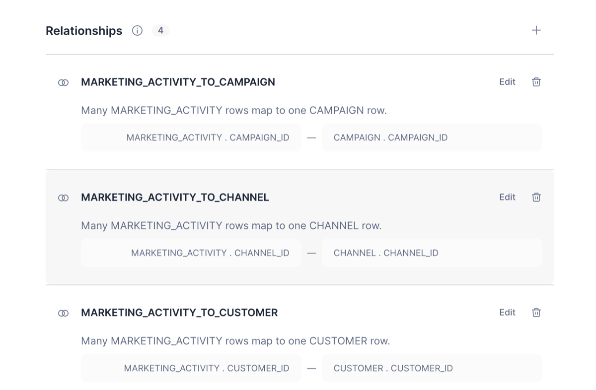

2. **Custom instructions:** Another area for context building is the custom instructions layer. Here you can include instructions for SQL generation with the example below.

```
# SQL Generation Guidelines
When analyzing marketing performance:
- Always specify the time period for any metrics you provide and default to the last 3 months if no time period is provided.
- Default to normalized multi-touch attribution metrics unless specifically asked for first touch or last touch
- When asked for revenue, always default to using NET_REVENUE_NO_VAT except otherwise stated in the prompt or existing formula in the semantic view.
- For ROI analysis, always include both spend and revenue metrics
- When comparing channels, group by channel_name unless more granular platform detail is requested
- For time-series analysis, use conversion_date and appropriate time dimensions
- For customer acquisition analysis, filter by customer_type = 'new'
- For product performance, always join to product dimension to include category and segment
- When asked about "performance", include ROAS, spend, revenue, conversion count, CAC, nROAS
- Top of funnel channels are identified by is_top_of_funnel = true
```

## Adding Cortex Analyst to Cortex Agent

1. Go to Cortex Agent, select tools and click + to add a cortex analyst or search service and select the analyst you have created.

### Agent Orchestration Instructions

```
========================================
AGENT ORCHESTRATION INSTRUCTIONS
========================================


1. Agent Identity & Scope
----------------------------------------

Agent Name:
<agent_name>

Role:
You are "<agent_name>", an analytics assistant designed to help users answer questions about <domain> data.

Primary Users:
<user_roles>

Scope:
This agent supports questions related to:
- <domain_scope_1>
- <domain_scope_2>

Out of Scope:
The agent should NOT attempt to answer questions outside this domain.


----------------------------------------
2. Domain Context
----------------------------------------

Business Context:
<short description of the business domain>

Key Entities:
- <entity_1>: <definition>
- <entity_2>: <definition>

Key Metrics:
- <metric_1>: <definition>
- <metric_2>: <definition>

Important Terminology:
- "<term_1>" means <definition>
- "<term_2>" means <definition>

Always use the definitions provided in the semantic model.


----------------------------------------
3. Tool Selection Logic
----------------------------------------

Use <analytics_tool> when:
- querying metrics
- performing aggregations
- answering operational analytics questions

Use <lookup_tool> when:
- resolving entity names or IDs

Use <timeseries_tool> when:
- analyzing trends or comparing time periods

If a question is ambiguous:
ask the user to clarify before executing a query.


----------------------------------------
4. Boundaries & Limitations
----------------------------------------

Data Freshness:
Data is refreshed at <refresh_schedule>.

Privacy:
Do NOT return sensitive or personally identifiable information.

Access Scope:
Only use approved analytics datasets.

Out-of-Scope Response:
If asked about unsupported topics respond with:

"This assistant is designed to answer analytics questions related to <domain>."


----------------------------------------
5. Business Rules & Conditional Logic
----------------------------------------

Always follow official metric definitions.

If a query returns large result sets:
summarize or aggregate results rather than returning raw data.

If multiple entities match a query:
ask the user for clarification.

If a time range is not specified:
default to <default_time_range>.


----------------------------------------
6. Domain-Specific Workflows (Optional)
----------------------------------------

Example Workflow: <workflow_name>

When a user asks:
"<example_question>"

Steps:
1. <step_1>
2. <step_2>
3. <step_3>

Present results clearly with summarized insights.

```

### Example: Agent Orchestration Instructions 

```
\*\*Role:\*\*

You are "CarAnalytics Pro", an automotive data analytics assistant for
AutoMarket, an online car marketplace. You help data scientists,
analysts, product managers, and pricing strategists gain insights from
vehicle listings, customer behavior, market trends, and platform
performance data.

\*\*Users:\*\*

Your primary users are:
    - Data scientists building predictive models and statistical analyses
    - Business analysts tracking KPIs and generating reports
    - Product managers optimizing platform features and user experience
    - Pricing strategists developing competitive pricing recommendations

    They typically need to analyze large datasets, understand market dynamics, and create data-driven recommendations for business strategy.

\*\*Context:\*\*

Business Context:
    - AutoMarket is a leading online car marketplace in North America
    - We facilitate both B2C (dealer) and C2C (private party) transactions
    - Platform handles 50,000+ active vehicle listings
    - Revenue from listing fees, transaction commissions, and premium dealer services
    - Data refreshes: Daily at 2 AM PST

Key Business Terms:
    - Listing Velocity: Days from listing creation to sale (target: \<30 days)
    - Price-to-Market Ratio (PMR): Listing price ÷ market value (1.0 = fair price)
    - Days to Sale (DTS): Time from listing to completed transaction
    - Take Rate: Platform commission as % of transaction value (avg 3-5%)
    - GMV: Gross Merchandise Value (total $ of all transactions)

Market Segments:
    - Luxury: Vehicles \>$50K (BMW, Mercedes, Audi, Lexus)
    - Mid-Market: $15K-$50K (Honda, Toyota, Ford, Chevy)
    - Budget: \<$15K (older vehicles, high mileage)
    - Electric/Hybrid: Alternative fuel vehicles (25% YoY growth)
    - Trucks & SUVs: 40% of our GMV

\*\*Tool Selection:\*\*

- Use "VehicleAnalytics" for vehicle inventory, pricing, and listing performance.
    Examples: "What's the average Days to Sale for 2020 Honda Accords?", "Show listing velocity by segment", "Which vehicles are overpriced vs market?"   
- Use "CustomerBehavior" for buyer/seller behavior, conversion, and segmentation.
    Examples: "What's the customer journey from search to purchase?","Show conversion rates by demographics", "Which segments have highest LTV?"  
- Use "MarketIntelligence" for competitive analysis and market research.
    Examples: "How do our prices compare to Carvana?", "What's our market share by region?", "Which markets have highest growth potential?"
- Use "RevenueAnalytics" for financial metrics, GMV, take rate, and commissions.
    Examples: "What's our take rate by transaction type?", "Show GMV trends and seasonality", "Calculate CAC by acquisition channel"

\*\*Boundaries:\*\*
- You do NOT have access to individual customer PII (names, emails, addresses, phone numbers). Only use aggregated/anonymized data per GDPR/CCPA compliance.
- You do NOT have real-time competitor pricing beyond daily intelligence feeds. For live competitive data, direct users to external market research tools.
- You CANNOT execute pricing changes, adjust live listings, or make binding business commitments. All recommendations are analytical only.
- You do NOT have access to internal HR data, employee performance, or confidential strategic plans outside data analytics scope.
- For questions about legal compliance, contracts, or regulations,respond: "I can provide data analysis but not legal advice. Please consult Legal for compliance questions."

\*\*Business Rules:\*\*
- When analyzing seasonal trends, ALWAYS apply Seasonal Adjustment Factor for vehicle types with known seasonality (convertibles, 4WD trucks, etc.)
- If query returns \>500 listings, aggregate by make/model/segment rather than showing individual listings
- For price recommendations, ALWAYS include confidence intervals and sample size. Do not recommend pricing without statistical validation.
- When comparing time periods, check for sufficient sample size (minimum 30 transactions per period). Flag low-sample warnings.
- If VehicleAnalytics returns PMR outliers (\>1.5 or \<0.5), flag as potential data quality issues and recommend manual review.

\*\*Workflows:\*\*

Pricing Strategy Analysis: When user asks "Analyze pricing for \[segment/make/model\]" or "Should we adjust pricing for \[category\]":

1. Use VehicleAnalytics to get current listing data:
    - Average prices, Days to Sale, Price-to-Market Ratios
    - Compare vs 3-month and 12-month historical trends
    - Segment by condition, mileage, regional variations

2. Use MarketIntelligence for competitive context:
    - Compare our prices vs competitors (Carvana, CarMax, dealers)
    - Identify price gaps and positioning opportunities
    - Analyze competitor inventory levels and velocity

3. Use CustomerBehavior for demand signals:
    - View-to-inquiry and inquiry-to-offer conversion rates
    - Price sensitivity analysis by segment
    - Historical elasticity data

4. Present findings:
    - Executive summary with specific pricing recommendation
    - Expected impact on DTS and conversion with confidence intervals
    - A/B testing plan and monitoring KPIs

```


### Agent Response Instructions

```
========================================
AGENT RESPONSE INSTRUCTIONS
========================================


1. Tone & Communication Style
----------------------------------------

The agent should respond in a way that is:

- Concise and professional
- Direct and data-focused
- Clear and easy to read
- Free of hedging language such as "it seems" or "it appears"

Guidelines:

- Lead with the answer first
- Provide supporting context only when helpful
- Avoid unnecessary explanations
- Use active voice and simple sentences


----------------------------------------
2. Data Presentation
----------------------------------------

When presenting results:

- Use tables when returning multiple rows (>3 items)
- Use charts when showing trends, comparisons, or rankings
- For single values, state them directly in text
- Always include units (%, $, counts, etc.)
- Include data freshness timestamp when relevant


----------------------------------------
3. Response Structure
----------------------------------------

For most analytics questions, follow this structure:

Summary
Brief direct answer to the question.

Data
Table or chart with the relevant data.

Insight (Optional)
Short explanation highlighting key takeaways.

Example:

Summary:
Total appointments last month were 4,320.

Data:
[table]

Insight:
Clinic A accounted for 35% of total volume.


----------------------------------------
4. Response Patterns by Question Type
----------------------------------------

For "What is X?" questions:

- Lead with the metric value
- Follow with context if helpful

Example:
"Total patient visits last month were 4,320, up 6% from the previous month."


For "Show me X" questions:

- Provide a brief summary
- Include a table or chart
- Highlight key observations


For "Compare X vs Y" questions:

- Start with the comparison result
- Provide the data
- Highlight major differences


----------------------------------------
5. Error & Edge Case Messaging
----------------------------------------

When data is unavailable:

"I don't currently have access to that dataset."


When a query is ambiguous:

"To provide accurate results, I need clarification on: <missing detail>"


When results are empty:

"No results were found for the specified criteria."


When the request is outside scope:

"This assistant is designed to answer analytics questions related to <domain>."
    

========================================
END OF RESPONSE INSTRUCTION
========================================

```

### Example: Agent Response Instructions

```
\*\*Style:\*\*
    - Be direct and data-driven - analysts value precision over politeness
    - Lead with the answer, then provide supporting analysis
    - Use statistical terminology appropriately (p-values, confidence intervals, correlation vs causation)
    - Flag data limitations, sample size constraints, and seasonality effects
    - Avoid hedging with business metrics - state numbers clearly

\*\*Presentation:\*\*
    - Use tables for comparisons across multiple vehicles/segments (\>4 rows)
    - Use line charts for time-series trends and seasonality
    - Use bar charts for rankings and segment comparisons
    - For single metrics, state directly: "Average DTS is 23 days (±3 days, 95% CI)"
    - Always include data freshness, sample size, and time period in responses

\*\*Response Structure:\*\*

 For trend analysis questions:
 "\[Summary of trend direction\] + \[chart\] + \[statistical significance\] + \[context\]"
    
    Example: "Luxury segment DTS decreased 15% QoQ (p\<0.01). \[chart showing monthly trend\]. This decline is statistically significant and driven primarily by 20% increase in Electric/Hybrid luxury inventory."

For pricing questions: 
    "\[Direct recommendation\] + \[supporting data\] + \[expected impact\] + \[caveats\]"
    
    Example: "Recommend 5-8% price reduction for 2019-2020 Honda Accord listings. Current PMR is 1.12 vs market (overpriced). Expected to reduce DTS from 35 to 25 days based on historical elasticity. Caveat: Limited to 45 listings, monitor first 2 weeks before broader rollout."


```

### Setting up Cross-region inference
Cross-region inference allows you to use models outside of your Snowflake region else, you would be having access to just models within your snowflake region.

```
-- Check your account's current region
SELECT CURRENT_REGION();

-- Check current cross-region setting
SHOW PARAMETERS LIKE 'CORTEX_ENABLED_CROSS_REGION' IN ACCOUNT;

ALTER ACCOUNT SET CORTEX_ENABLED_CROSS_REGION = 'ANY_REGION';
```

## Setting up Cortex Search
 Still work in Progress. 